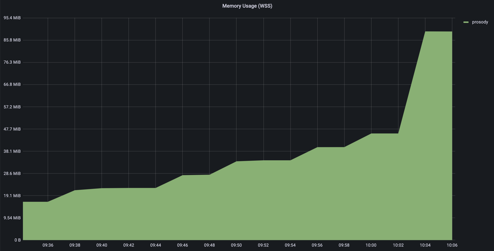
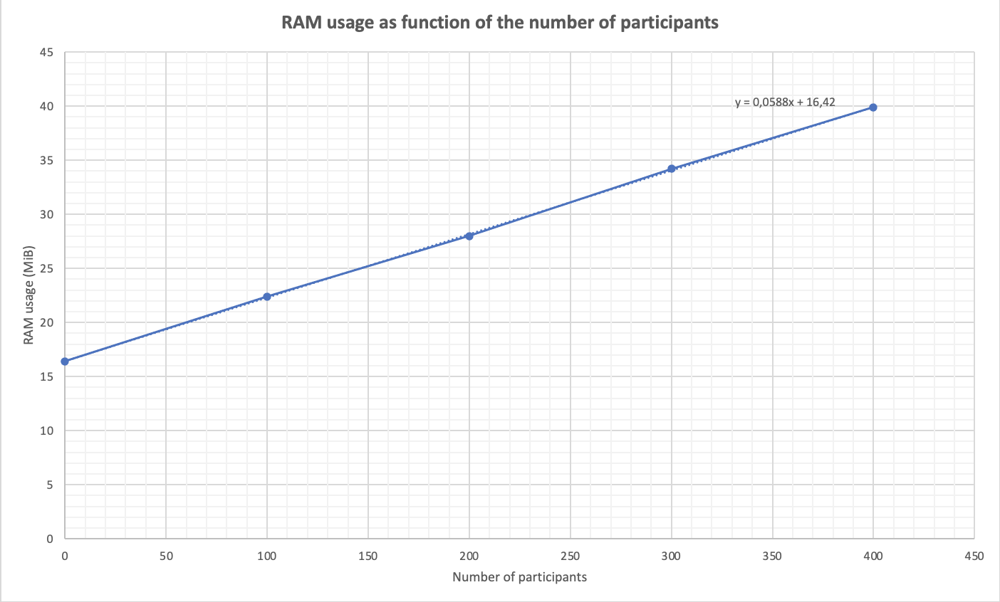
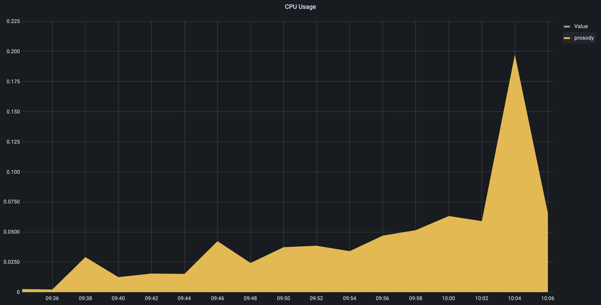
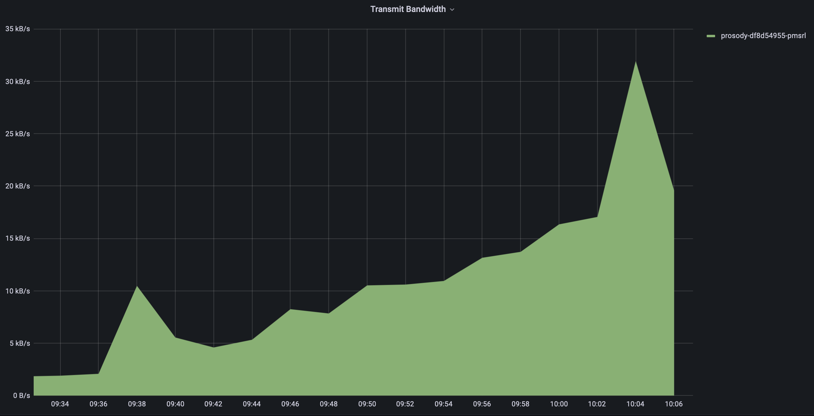

# Prosody tests

This document describes an attempt to test with [JXS](https://github.com/jitsi/jxs) the Prosody component of a Jitsi infrastructure deployed on Kubernetes with [this repository](https://github.com/openfun/jitsi-k8s). 

The given approach uses the [Parallel Multithreaded Machine](https://doc.pm2.io): as JXS tends to crash randomly sometimes, using `pm2` permits to add some stability to the testing process.

## Configuration

First, clone, install and build the project:
```bash
git clone https://github.com/jitsi/jxs
cd jxs
npm install
npm run build
```

Then, in your Jitsi installation, enable XMPP cross domain on Prosody:
```
XMPP_CROSS_DOMAIN=1
```

In order to be able to monitor our tests, enable debug on your Prosody component:
```
LOG_LEVEL=debug
```

Configure JXS by creating a `config.json` file:
```json
{
    "service": "wss://[meet.example.com]/xmpp-websocket",
    "domain": "[meet.example.com]"
}
```

Finally, create the `pm2-config.yml` pm2 configuration file that describes the deployment of your tests:
```yaml
apps:
  - name: batch
    script: dist/main.js
    args:
      - config.json
      - "2"  # number of conferences
      - "50"  # number of participants per conference
```
Launching a lot of conferences with many participants does not take much resources on the client. However, it is recommended **not to start launching more that 100 connections at the same time**, otherwise it will probably crash. One way to do it is to launch batches of 100 participants every 10 seconds.
You are also limited in the total amout of participants your add with one public IP address for the clients: every participant will take one network socket and computers have generally around 16000 allocatable client ports.

## Launch

To deploy your tests with `pm2`, just execute the following command:
```bash
pm2 start pm2-config.yml
```

To monitor the deployment of tests on the client, execute the following command:
```bash
pm2 logs
```
To enable debug mode and have more information, you may uncomment the 68th line of `src/index.js` and re-build the project.

On the prosody server, look at the logs to verify that your tests are working. On a Kubernetes infrastructure, it may be done with:
```bash
kubectl logs -f -n <namespace> <prosody pod>
```

## Results

### Preparation test

In order to have some idea of what kind of logs you may encounter, a 1-participant test was done:
* [logs from the prosody server](./log_server.txt).
* [logs from the client](./log_client.txt).

You can noticed that the Jicofo component have not been added to the room; we hope that our tests will still be relevant to stress test Prosody.

### Main test

Batches of 100 participants (2 conferences of 50 participants) were applied; the stabilization of metrics (especially RAM on the JVB pod) is reached before each new batch is applied.

When the fifth batch is launched (between 400 and 500 participants), an `Unexpected server response: 500` occured and after a few restarts of the PM2 process, the batch is applied. [Logs from the Prosody server](./log_error_limit.txt) has been saved during this problem.

The RAM usage seems to be linear in the number of participants.



CPU load and bandwidth stay very low on the Prosody pod.




## Conclusion

RAM usage can be modelized as a linear function of the number of participants, so all estimations on the Prosody component must take that into account for resource allocation.

It is imperative to test if the `error 500` are a consequence of the peculiar functioning of JXS or if the JXS tests are representative of the normal functioning of Prosody.
